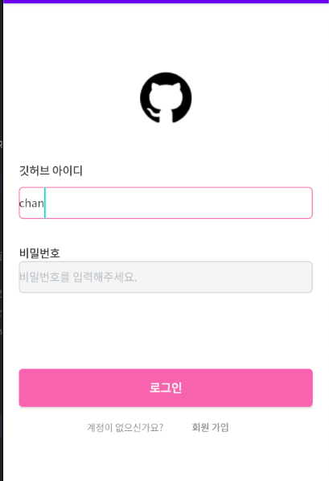
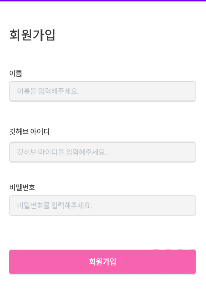
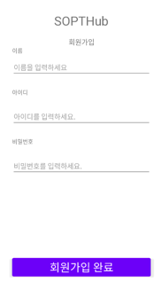
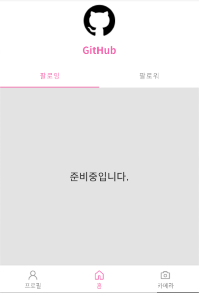

# week3

## level1

---

### 로그인 화면

#### SignInActivity

- editText, Button selector 적용한 모습

- editText

~~~xml

<selector xmlns:android="http://schemas.android.com/apk/res/android">
    <item
            android:state_focused="true"
            android:drawable="@drawable/edit_text_true"/>
    <item android:drawable="@drawable/edit_text_false"/>
</selector>
~~~

~~~xml

<item android:color="@color/week3_pink" android:state_checked="true"/>
<item android:color="@color/week3_gray" android:state_checked="false"/>
~~~

- Button

~~~xml

<shape
        xmlns:android="http://schemas.android.com/apk/res/android"
        android:shape="rectangle">
    <corners android:radius="5dp"/>
    <solid android:color="@color/week3_pink"/>
</shape>
~~~

---

#### SignUpActivity

- 회원 가입 화면도 동일하게 적용

---

#### HomeActivity

- BottomNavigationView에 selector 적용

~~~xml

<com.google.android.material.bottomnavigation.BottomNavigationView
        android:layout_width="match_parent"
        android:layout_height="wrap_content"
        app:layout_constraintStart_toStartOf="parent"
        app:layout_constraintEnd_toEndOf="parent"
        app:layout_constraintBottom_toBottomOf="parent"
        app:menu="@menu/menu"
        app:itemTextColor="@color/color"
        app:itemRippleColor="#FFBEBE"
        app:itemIconTint="@color/color"
        android:id="@+id/bnv_sample"
/>
~~~

- Button selector 적용
~~~xml

<androidx.appcompat.widget.AppCompatButton
        android:layout_width="0dp"
        android:layout_height="wrap_content"
        android:id="@+id/bt_repository"
        android:textColor="@color/profile_button_text"
        android:background="@drawable/profile_button"
        tools:textColor="@color/profile_button_text"
        tools:background="@color/profile_button"
        app:layout_constraintEnd_toEndOf="parent"
        app:layout_constraintStart_toEndOf="@id/bt_follower"
        app:layout_constraintTop_toBottomOf="@+id/layout_profile"
        android:layout_margin="12dp"
        android:text="repository"
/>
~~~

---
