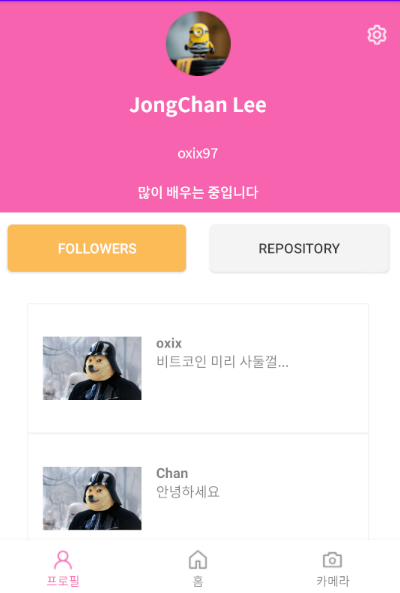
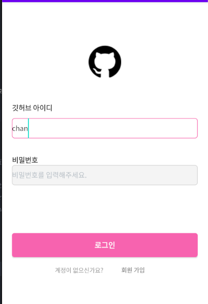

## 1차 세미나 과제

### 목차

- [level1\_로그인 페이지](#로그인-페이지)
- [level1\_회원가입 페이지](#회원가입-페이지)
- [level1\_자기소개 페이지](#자기소개-페이지)
- [level2-1](#level-2-1)
- [level2-2](#level-2-2)
- [level2-3](#level-2-3)
- [level3-1](#level-3-1)
- [level3-2](#level-3-2)
- [배운 것](#배운-것)
---

### 로그인 페이지

- [SignInActivity.kt](https://github.com/29th-WE-SOPT-Android-Part/Android-Jongchan/blob/week1/app/src/main/java/com/example/sopt_week1/SignInActivity.kt)
- [action_sign_in.xml](https://github.com/29th-WE-SOPT-Android-Part/Android-Jongchan/blob/week1/app/src/main/res/layout/activity_sign_in.xml)


해당 화면의 layout은 constraintView를 사용하였고 textView, editTextView
각각 위에 부분에 있는 View들의 밑에 배치하였고 margin값을 주어 간격을 주었습니다.

모든 editText같은 경우 투명색으로 써있는 글씨는 android:hint=" " 를 사용하였고
비밀번호를 입력받는 editText같은 경우 android:inputType="numberPassword"를
사용하여 작성되는 값이 보이지 않게 됩니다.

```xml
<EditText android:layout_width="0dp"
              android:layout_height="wrap_content"
              android:id="@+id/pwEditText"
              android:hint="비밀번호를 입력하세요."
              android:layout_margin="30dp"
              android:inputType="numberPassword"
              app:layout_constraintTop_toBottomOf="@+id/tv_pw"
              app:layout_constraintStart_toStartOf="parent"
              app:layout_constraintEnd_toEndOf="parent"/>
```

로그인 버튼을 누를경우 setOnClickListener함수가 작동되며
editText가 빈 값인 경우가 하나라도 있으면 Toast 메세지를 출력하며
모두 빈 값이 아닌경우 자기소개 화면 HomeActivity 으로 넘어가게 됩니다.
editText 값 체크는 isNullOrBlank() 메서드를 활용하여 체크하였습니다.

```kotlin
binding.login.setOnClickListener {
    if (!binding.idEditText.text.isNullOrBlank() && !binding.pwEditText.text.isNullOrBlank()) {
        Toast.makeText(this, "${binding.idEditText.text}님 환영합니다.", Toast.LENGTH_SHORT).show()
        startActivity(longIntent)
    } else {
        Toast.makeText(this, "로그인 실패", Toast.LENGTH_SHORT).show()
    }
}
```

---

### 회원가입 페이지

- [SignUpActivity.kt](https://github.com/29th-WE-SOPT-Android-Part/Android-Jongchan/blob/week1/app/src/main/java/com/example/sopt_week1/SignUpActivity.kt)
- [activity_sign_up.xml](https://github.com/29th-WE-SOPT-Android-Part/Android-Jongchan/blob/week1/app/src/main/res/layout/activity_sign_up.xml)



constraintLayout 활용하여 각 View들을 배치하였으며 회원 가입 완료 버튼의 경우
[로그인 페이지]()에 textNullChecker()로 모든 editText가 비어있는 것을 검사합니다.
모든 editText가 null이 아닌경우 finish()가 작동되어 이전 View인  
로그인 페이지 [SignInActivity]로 이동합니다.

---

### 자기소개 페이지

- [HomeActivity](https://github.com/29th-WE-SOPT-Android-Part/Android-Jongchan/blob/week1/app/src/main/java/com/example/sopt_week1/HomeActivity.kt)
- [activity_home](https://github.com/29th-WE-SOPT-Android-Part/Android-Jongchan/blob/week1/app/src/main/res/layout/activity_home.xml)



이전 뷰들과 같이 constraintView를 사용하여 imageView, textView를 배치하였습니다.
imageView의 사진은 drawable 폴더에서 이미지를 가져왔습니다.

---

### level 2-1

#### SignUpActivity

- 회원가입화면에서 이전 로그인 화면으로 데이터를 보내기 위해 putExtra()를 사용하였습니다.
- editText 값을 체크하기 위해 isNullOrBlank()함수를 사용하였습니다.

```kotlin
private fun textNullChecker(): Boolean {
        if (!binding.etName.text.isNullOrBlank()&& !binding.etId.text.isNullOrBlank() && !binding.etPw.text.isNullOrBlank())
            return true
        return false
    }
```

```kotlin
binding.btSignUp.setOnClickListener {
            if (textNullChecker()) {
                val intent = Intent()
                intent.putExtra("setId", binding.etId.text.toString())
                intent.putExtra("setPw", binding.etPw.text.toString())
                setResult(RESULT_OK, intent)
                Toast.makeText(this,"회원가입이 완료 되었습니다.",Toast.LENGTH_SHORT).show()
                finish()
            } else {
                Toast.makeText(this, "입력되지 않은 정보가 있습니다.", Toast.LENGTH_SHORT).show()
            }
        }
```

#### SignInActivity

- SignInActivity에서 정보를 받기위해 registerForActivityResult()를 사용하였습니다.

```kotlin
private lateinit var getResultText: ActivityResultLauncher<Intent>
```

```kotlin
 getResultText = registerForActivityResult(ActivityResultContracts.StartActivityForResult()) {
            if (it.resultCode == RESULT_OK) {
                val id = it.data?.getStringExtra("setId")
                val pw = it.data?.getStringExtra("setPw")
                binding.idEditText.setText(id)
                binding.pwEditText.setText(pw)
            }
        }
```

---

### [level 2-2]()

#### HomeActivity

- #### 인텐트

인텐트는 앱에서 무언가 작업을 수행하기 위해 사용되는 일종의 전달수단이다. 또한 내가 만든 액티비티나
애플리 케이션의 구성요소가 해얗라 일을 지정하는 것 외에 타 애플리케이션의 기능을 수행하는 유연한 기능입니다.

- #### 명시적 인텐트

명시적 인텐트는 인텐트에 클래스 객체나 컴포넌트 이름을 지정하여 호출할 대상을 확실하게 알 수 있는 경우에 사용한다.
주로 애플리케이션 내부에서 사용되며 특정 컴포넌트나 액티비티가 명확하게 실행되어야할 경우에 사용됩니다.

- #### 암시적 인텐트

암시적 인텐트는 인텐트의 액션과 데이터를 지정하긴 했지만,
호출할 대상이 달라질 수 있는 경우에는 암시적 인텐트를 사용합니다.

예를 들어 문서편집기 같은 경우 pdf 파일을 열기 위해 어떠한 문서 편집기를 선택할지 사용자에게 선택할 수 있는
위젯을 띄우는 것이 암시적 인텐트의 역할입니다.

---

### [level 2-3]()

#### HomeActivity


- 이미지 비율을 1:1로 맞추기 위해 constraintDimensionRatio 속성을 이용해 1:1로 맞췄습니다.
- 화면에 보이지 않는 자기 소개 부분을 nestedScrollView로 하여 스크롤 가능하게 하였습니다.

```xml
    <ImageView android:layout_width="150dp"
               android:layout_height="150dp"
               android:id="@+id/iv_image"
               app:layout_constraintDimensionRatio="1:1"
               app:layout_constraintTop_toBottomOf="@id/tv_title"
               android:layout_margin="30dp"
               app:layout_constraintStart_toStartOf="parent"
               app:layout_constraintEnd_toEndOf="parent"
               app:srcCompat="@drawable/dogi"/>
```

```xml
<androidx.core.widget.NestedScrollView
            android:layout_width="0dp"
            android:layout_height="wrap_content"
            app:layout_constraintStart_toStartOf="parent"
            app:layout_constraintEnd_toEndOf="parent"
            android:layout_marginTop="30dp"
            app:layout_constraintTop_toBottomOf="@+id/ib_githubButton">
        <LinearLayout android:layout_width="wrap_content"
                      android:layout_height="wrap_content"
                      android:orientation="vertical">
            <TextView android:layout_width="wrap_content"
                      android:layout_height="wrap_content"
                      android:text="안녕하세요 이종찬입니다."
                      android:textSize="28sp"
                      android:layout_margin="30dp"/>
            <TextView android:layout_width="wrap_content"
                      android:layout_height="wrap_content"
                      android:text="안녕하세요 이종찬입니다."
                      android:textSize="28sp"
                      android:layout_margin="30dp"/>
            <TextView android:layout_width="wrap_content"
                      android:layout_height="wrap_content"
                      android:text="안녕하세요 이종찬입니다."
                      android:textSize="28sp"
                      android:layout_margin="30dp"/>
            <TextView android:layout_width="wrap_content"
                      android:layout_height="wrap_content"
                      android:text="화성 갈끄니까~~~~~~"
                      android:textSize="28sp"
                      android:layout_margin="30dp"/>
        </LinearLayout>
    </androidx.core.widget.NestedScrollView>
```

[comment]: <> (### [level 3-1]&#40;&#41;)

[comment]: <> (### [level 3-2]&#40;&#41;)

---

### 배운 것

1. ViewBinding 사용
2. 명시적 인텐트와 암시적 인텐트의 차이
3. registerforactivityresult 사용방법
4. isNullOrEmpty() 라는 함수를 통하여 null 체크 하는 방법
5. DataBinding 사용


